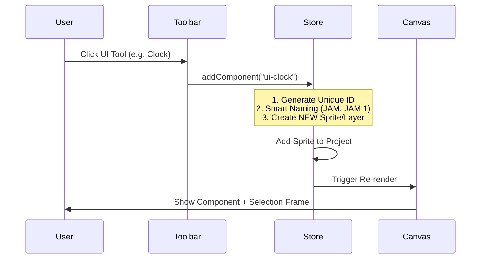
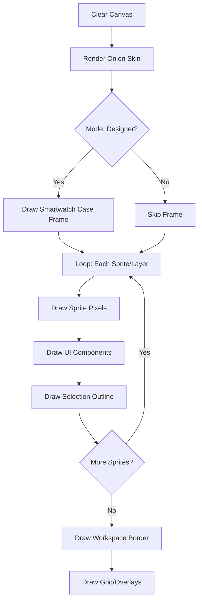
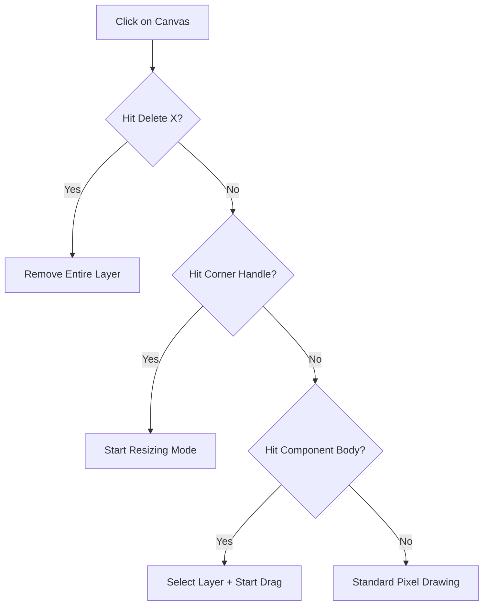

# 🤖 Mochi Animator: Technical Documentation & Dev Log

Dokumentasi ini merangkum seluruh arsitektur, fitur, dan logika yang telah diimplementasikan hingga saat ini.

## 🌟 Core Architecture Overview

Mochi Animator menggunakan **Zustand** sebagai state management utama (`projectStore.js`) untuk sinkronisasi data antara canvas, timeline, dan sidebar.

### 1. Dual-Mode System
Aplikasi memiliki dua mode utama yang saling berbagi data namun memiliki interface berbeda:
- **Animator Mode**: Fokus pada pixel-art, keyframing, dan onion skinning.
- **Designer (Lopaka) Mode**: Fokus pada UI/UX smartwatch dengan sistem drag-and-drop komponen interaktif.

---

## 📊 Logic Diagrams

### A. Component Addition Flow (Step 3 & 4)
Alur ketika user menambahkan komponen UI baru:

### B. Canvas Rendering Pipeline
Urutan drawing pada canvas setiap frame (Penting untuk urutan layer):

### C. Interaction Logic (Canva-style)
Logika deteksi klik pada canvas:

---

## 🛠️ Feature List (Implemented)

### 🎨 Drawing & Animation
- **Pencil & Eraser**: Mendukung pengaturan ukuran (radius) dan bentuk (Kotak/Bulat).
- **Zoom System**: Slider zoom + dukungan **Pinch-to-Zoom** via Trackpad.
- **Timeline**: 
    - Pengaturan FPS (Frame Per Second).
    - Durasi animasi via Slider atau Input angka.
    - Onion Skinning (Melihat frame sebelum/sesudah).
- **Canvas Border**: Separasi visual yang jelas dengan border warna (Hijau/Merah).

### ⚙️ UI Designer (Lopaka)
- **Component Drawer**: Jam (Real-time), Label (Custom Text), Bar (Progress), Graph, dan Icon.
- **Layer-per-Component**: Setiap widget otomatis memiliki layer sendiri agar tidak tumpang tindih.
- **Canva Interaction**: 
    - **Resize Handles**: Tarik sudut kotak untuk mengubah ukuran.
    - **Delete Button (X)**: Tombol hapus cepat di pojok kiri atas objek.
    - **Auto-Selection**: Klik objek di canvas otomatis memilih layer-nya.
- **Property Editor**: Sidebar kanan untuk ganti Teks, Format Jam, dan Value Progress Bar.

---

## 📂 Project Structure Overview
- `/src/store/projectStore.js`: Otak dari seluruh logika aplikasi.
- `/src/components/canvas/PixelCanvas.jsx`: Engine rendering utama menggunakan Canvas API.
- `/src/components/designer/ComponentSettings.jsx`: Panel editor properti widget.
- `/src/components/layers/LayerPanel.jsx`: Manajemen layer (Add, Delete, Rename).

---

## 🚧 Upcoming (Step 5)
- **C++ Code Export**: Menghasilkan kode Arduino/ESP32 yang kompatibel dengan library grafis.
- **Asset Library**: Penyimpanan template animasi dan icon tambahan.
