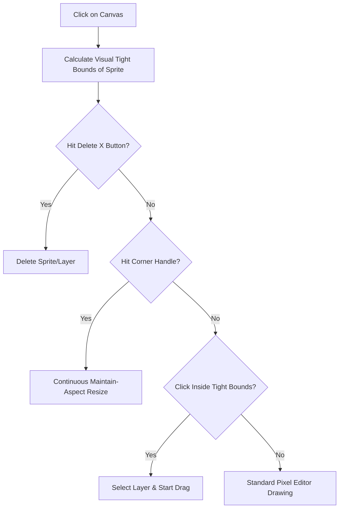
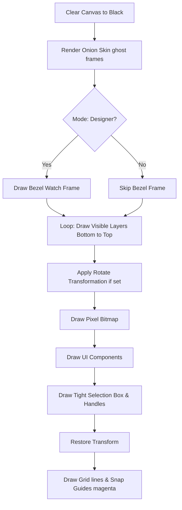

# 🤖 Mochi Animator: Technical Documentation & Feature Catalog

Dokumentasi ini merangkum seluruh arsitektur, fitur premium, dan log perubahan logika yang telah diimplementasikan pada **Mochi Animator Online**.

---

## 🌟 Core Architecture Overview

Mochi Animator menggunakan **Zustand** (`projectStore.js`) sebagai single source of truth untuk mensinkronisasi data canvas, timeline keypoints, dan panel properties secara real-time.

### 1. Dual-Mode Workspace
Aplikasi memiliki dua mode utama yang saling berbagi data:
- **Animator Mode**: Berfokus pada pixel-art, keyframing (tweening), dan onion skinning.
- **Designer Mode**: Berfokus pada UI/UX smartwatch dengan sistem drag-and-drop komponen widget.

---

## 📊 Logic Diagrams

### A. Canva-Style Interaction Flow
Logika penanganan klik presisi tinggi (hit detection):

### B. Canvas Rendering Pipeline
Urutan render real-time di `PixelCanvas.jsx` (Layering Order):

---

## 🛠️ Complete Feature Catalog (Implemented)

### 1. 🎨 Advanced Pixel Art Editor & Layering
- **Pencil & Eraser**: Mendukung kustomisasi ukuran kuas (Brush Size) dan bentuk kuas (Kotak / Bulat).
- **Flood Fill (Paint Bucket)**: Mengisi area pixel yang terhubung dengan instan.
- **Advanced Shapes**: Dukungan pembuatan Kotak (Rectangle), Lingkaran (Ellipse), dan Kotak dengan Radius (Rounded Rect) dengan preview overlay dinamis.
- **Independent Layers**: Layering tak terbatas. Setiap layer memiliki kontrol penuh atas nama, visibilitas (show/hide), visibilitas frame, dan grid lock.

### 2. ⚡ KineMaster-Style Keypoint Tweening
- **Keypoint Animation**: Mengubah istilah kaku "Frame" menjadi **"Keypoint"** layaknya KineMaster untuk workflow yang lebih intuitif.
- **Auto-Keyframing**: Cukup geser sprite di timeline pada frame tertentu, sistem akan otomatis menanam Pin Point (Keypoint) baru.
- **Linear Interpolation (Tweening)**: Aplikasi otomatis menghitung posisi visual di antara keyframe secara mulus, tidak perlu gambar manual di tiap frame.
- **Onion Skinning**: Tampilan bayangan semitransparan dari frame sebelum dan sesudah untuk presisi tinggi.

### 3. 🎯 Canva-Style Smart Layout & Snapping
- **Tight Bounding Box (Auto-Bounds)**: Kotak seleksi hijau yang sebelumnya kaku (128x64) sekarang otomatis menyusut dan nge-pres (mepet) mengikuti dimensi visual pixel yang digambar (*Tight Bounding Box*).
- **High-Precision Selection (No Confusions)**: Klik area kosong tidak akan lagi menyeleksi atau menggeser sprite secara tidak sengaja. Klik hanya dideteksi jika pointer benar-benar mengenai visual pixel yang digambar (*Visual Tight Bounds Hit*).
- **Smart Magnet Snapping**: Kesejajaran instan dengan deteksi tengah (Center) dan tepi (Edge) canvas maupun layer lain. Saat mendeteksi kesejajaran, garis pemandu **Magenta** ala Canva otomatis muncul.
- **Magnet Switch**: Tombol cepat di Toolbar untuk menyalakan/mematikan magnet snapping kapan saja.

### 4. 🔄 Transformation Tools (Sizing & Rotation)
- **Continuous Rotation Control**:
  - Slider rotasi **0-359°** di Properties Panel kanan bawah untuk memutar sprite secara presisi derajat demi derajat.
  - Tombol pintas preset rotasi instan (**0°**, **90°**, **180°**, **270°**).
  - Rotasi visual dihitung presisi dari titik pusat visual (*visual center*) sprite.
- **90° CW Pixel Rotator**: Tombol sekali klik di Toolbar untuk langsung memutar grid array pixel 90 derajat searah jarum jam.
- **Resize Handles (Maintain Aspect Ratio)**: Kotak seleksi memiliki 4 handle di sudut (TL, TR, BL, BR) untuk memperbesar/memperkecil sprite dengan aspect-ratio yang tetap terjaga.

### 5. 🎛️ Timeline UX & Navigation
- **Global Timeline Scrubber**: Slider utama diletakkan di bagian paling bawah bar control untuk mengontrol dan melihat keseluruhan pergerakan frame secara universal.
- **Timeline Scroll & Shift-Scroll**: Timeline dapat di-scroll vertikal jika memiliki banyak layer, dan mendukung pergeseran horizontal menggunakan **SHIFT + Scroll Wheel**.
- **Double-Click to Add**: Double-click pada sel timeline yang kosong untuk langsung membuat keypoint baru.
- **Contextual Keypoint Toggle**: Tombol putar playback otomatis berganti fungsi menjadi **"Add Keypoint"** (tambah frame) jika frame saat ini kosong, dan **"Delete Keypoint"** (hapus frame) jika frame tersebut sudah berisi keypoint.

### 6. 📤 Micro-Deployment Export Options
- **Multi-Format Export**: Eksport aset langsung ke format microcontroller-ready:
  - `.h` (Bitmap byte array header file).
  - `.cpp` (Bitmap implementations).
  - `.md` (Dokumentasi rendering).
- **Download as ZIP**: Mengekspor dan membungkus ketiga format di atas langsung ke dalam satu file ZIP untuk workflow deployment Arduino/ESP32 sekali klik.

---

## 📂 Project Structure Map
- `src/store/projectStore.js`: Otak utama state management (history, undo/redo, tween logic, layer actions).
- `src/components/canvas/PixelCanvas.jsx`: Engine rendering utama dengan HTML5 Canvas, interaksi drag, snapping, dan transform rotasi.
- `src/components/layers/PropertiesPanel.jsx`: Mengontrol properti presisi tinggi (X, Y, W, H, dan Slider Rotasi).
- `src/components/timeline/Timeline.jsx` & `TimelineRow.jsx`: Alur kerja timeline, keypoint scrubber, dan navigasi wheel.
